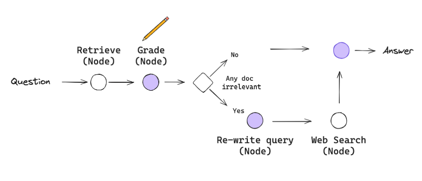

# CRAG API

Corrective RAG API with OpenAI, Tavily Search, Pinecone vector DB, and FastAPI.


## Features
- Retrieval-Augmented Generation (RAG) workflow
- Document ingestion and vector storage with Pinecone
- Relevance grading and question rewriting with OpenAI LLMs
- Web search fallback with Tavily
- REST API endpoints for question answering and updating document sources

## Requirements
- Python 3.8+
- pip

## Setup

1. **Clone the repository**

```bash
git clone <your-repo-url>
cd CRAG
```

2. **Install dependencies**

```bash
pip install -r requirements.txt
```

3. **Configure environment variables**

- Copy the example environment file and fill in your API keys:

```bash
cp .env.example .env
```

- Edit `.env` and set your actual API keys and configuration values:

```
LANGCHAIN_TRACING_V2=true
LANGCHAIN_ENDPOINT=https://api.smith.langchain.com
LANGCHAIN_API_KEY=your_langchain_api_key_here
OPENAI_API_KEY=your_openai_api_key_here
TAVILY_API_KEY=your_tavily_api_key_here
PINECONE_API_KEY=your_pinecone_api_key_here
```

## Running the App

Start the FastAPI server:

```bash
python crag_api.py
```

The API will be available at `http://localhost:8000`.

## API Endpoints

### `POST /ask`
Ask a question and get an answer.

**Request body:**
```json
{
  "question": "What is Retrieval-Augmented Generation?"
}
```

**Response:**
```json
{
  "answer": "..."
}
```

### `POST /update_urls`
Update the list of document source URLs and refresh the vector store.

**Request body:**
```json
{
  "urls": ["https://example.com/article1", "https://example.com/article2"]
}
```

**Response:**
```json
{
  "status": "success",
  "message": "URLs updated and vectorstore refreshed."
}
```

## Notes
- Make sure your API keys are valid and have sufficient quota.
- The `.env` file should never be committed to version control.
- For development, you can use the interactive API docs at `http://localhost:8000/docs`.

## License
MIT

